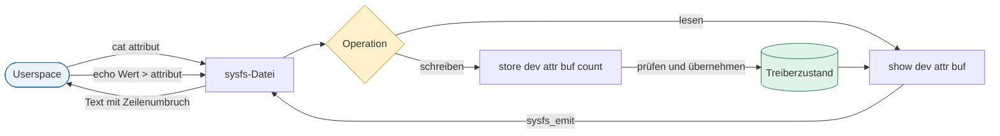

# Exkurs: Device Attributes in Linux-Gerätetreibern

**Device Attributes** stellen Eigenschaften eines Kernel-Geräts als Dateien in `sysfs` bereit. Ein Attribut kann einen Zustand anzeigen, eine Konfiguration entgegennehmen oder beides. Es gehört zu genau einer `struct device` und erscheint typischerweise unter `/sys/devices/.../attribut`; Pfade unter `/sys/class` oder `/sys/bus` sind häufig symbolische Links auf dieses Gerät.

## Vom Dateizugriff zum Treiber



`sysfs` ruft `show()` oder `store()` pro Lese- beziehungsweise Schreibvorgang genau einmal auf. Der Puffer ist `PAGE_SIZE` groß. `show()` liefert die Anzahl der erzeugten Bytes; `store()` gibt bei vollständig verarbeitetem Inhalt `count` zurück. Ungültige Eingaben werden mit einem negativen Fehlercode abgewiesen.

## Minimales Read-write-Attribut

```c
struct foo_device {
    struct device *dev;
    struct mutex lock;
    unsigned int rate;
};

static ssize_t rate_show(struct device *dev,
                         struct device_attribute *attr, char *buf)
{
    struct foo_device *foo = dev_get_drvdata(dev);

    return sysfs_emit(buf, "%u\n", foo->rate);
}

static ssize_t rate_store(struct device *dev,
                          struct device_attribute *attr,
                          const char *buf, size_t count)
{
    struct foo_device *foo = dev_get_drvdata(dev);
    unsigned int value;
    int ret;

    ret = kstrtouint(buf, 0, &value);
    if (ret)
        return ret;
    if (value < 1 || value > 1000)
        return -ERANGE;

    mutex_lock(&foo->lock);
    foo->rate = value;
    mutex_unlock(&foo->lock);
    return count;
}

static DEVICE_ATTR_RW(rate);
```

`DEVICE_ATTR_RW(rate)` erzeugt `dev_attr_rate` mit Modus `0644` und erwartet `rate_show()` sowie `rate_store()`. Für reine Statuswerte gibt es `DEVICE_ATTR_RO(name)`, für reine Schreibschnittstellen `DEVICE_ATTR_WO(name)`. Rechte sollten so restriktiv wie möglich sein; sicherheitskritische Einstellungen gehören nicht in eine allgemein beschreibbare Datei.

## Attribute als Gruppe registrieren

```c
static struct attribute *foo_attrs[] = {
    &dev_attr_rate.attr,
    NULL,
};

ATTRIBUTE_GROUPS(foo);

static struct platform_driver foo_driver = {
    .driver = {
        .name = "foo",
        .dev_groups = foo_groups,
    },
    .probe = foo_probe,
};
```

Attributgruppen sind Einzelaufrufen von `device_create_file()` vorzuziehen: Der Driver Core erstellt und entfernt die Dateien passend zur Bindung des Treibers und kann Fehler vollständig zurückrollen. Müssen Attribute erst während `probe()` ergänzt werden, bietet sich eine verwaltete Gruppe wie `devm_device_add_groups()` an. Attribute, die bereits beim Geräte-Add-Event sichtbar sein müssen, gehören in die vor der Registrierung festgelegten Gruppen.

## Entwurfsregeln

- Pro Datei möglichst genau **einen Wert** in einer stabilen, dokumentierten Einheit exportieren.
- Textausgaben mit `sysfs_emit()` formatieren und mit `\n` abschließen.
- Eingaben mit Helfern wie `kstrtouint()`, `kstrtobool()` oder `sysfs_streq()` vollständig prüfen.
- Gemeinsamen Zustand gegen konkurrierende Zugriffe sperren; `show()` und `store()` können parallel zu anderen Treiberpfaden laufen.
- In Callbacks keine langlebigen Userspace-Zeiger speichern. Das dargestellte physische Gerät kann trotz gültigem Kernelobjekt bereits entfernt oder nicht erreichbar sein.
- `store()` muss Hardwarefehler an Userspace zurückgeben und darf den Softwarezustand nicht als erfolgreich geändert darstellen, wenn die Hardwareaktualisierung fehlschlägt.
- Für standardisierte Subsysteme wie IIO, hwmon, netdev oder power_supply deren vorhandene ABI und Hilfsfunktionen verwenden, statt eigene Attributnamen zu erfinden.
- Neue Userspace-Schnittstellen unter `Documentation/ABI/` beschreiben; einmal veröffentlichte sysfs-ABI bleibt langfristig kompatibilitätsrelevant.

## Merksatz

Ein Device Attribute ist keine beliebige Debug-Datei, sondern eine kleine Userspace-API: **ein klarer Wert, eindeutige Rechte, robuste Eingabeprüfung, korrekte Synchronisation und ein stabiler Lebenszyklus**.

## Quellen und Vertiefung

- [Linux-Kernel-Dokumentation: sysfs](https://docs.kernel.org/filesystems/sysfs.html)
- [Linux-Kernel-Dokumentation: Device drivers infrastructure](https://docs.kernel.org/driver-api/infrastructure.html)
- [Linux-Kernel-Dokumentation: The Basic Device Structure](https://docs.kernel.org/driver-api/driver-model/device.html)
- [Linux-Kernel-Dokumentation: Linux ABI description](https://docs.kernel.org/admin-guide/abi.html)
