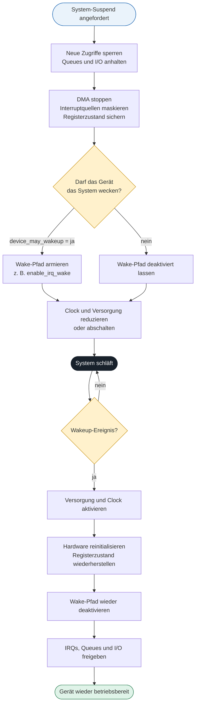

# Exkurs: Power Management in Linux-Gerätetreibern

Linux unterscheidet zwei Formen des Geräte-Power-Managements: **System Sleep** versetzt das gesamte System in einen Schlafzustand, während **Runtime PM** einzelne, gerade unbenutzte Geräte im laufenden Betrieb abschaltet. Der PM Core koordiniert Reihenfolge und Zustand; der Treiber muss I/O kontrolliert stoppen, die Hardware sichern und Wakeup gezielt konfigurieren.

## Ablauf von Suspend, Wakeup und Resume



## System Suspend und Resume

Der Suspend läuft mehrphasig ab:

```text
prepare → suspend → suspend_late → suspend_noirq
```

- Neue Zugriffe blockieren, Queues anhalten und laufendes I/O beenden.
- DMA stoppen, Interruptquellen maskieren und notwendigen Registerzustand sichern.
- Erst danach Clocks, Regulatoren oder Power Domains abschalten.
- In `suspend_noirq()` dürfen keine normalen IRQ-Handler mehr benötigt werden.
- Liefert ein Suspend-Callback einen Fehler, bricht der PM Core den Übergang ab und nimmt bereits suspendierte Geräte wieder in Betrieb.

Der Resume erfolgt in umgekehrten Phasen:

```text
resume_noirq → resume_early → resume → complete
```

- Versorgung und Clocks aktivieren.
- Hardware reinitialisieren und gesicherten Zustand wiederherstellen.
- Erst bei vollständiger Betriebsbereitschaft IRQs, Queues und I/O freigeben.

Die Callbacks werden über `struct dev_pm_ops` an den Treiber gebunden. Ein einfacher Treiber benötigt meist nur `suspend()` und `resume()`; die zusätzlichen Phasen sind für Hardware mit besonderen IRQ-, Bus- oder Abhängigkeitsanforderungen vorgesehen.

## Runtime PM im Datenpfad

Runtime PM verwendet einen Usage Counter. Solange er größer als null ist, darf das Gerät nicht suspendiert werden. Ein typisches Zugriffsmuster lautet:

```c
ret = pm_runtime_resume_and_get(dev);
if (ret < 0)
    return ret;

/* Registerzugriff oder I/O */

pm_runtime_mark_last_busy(dev);
pm_runtime_put_autosuspend(dev);
```

Die zugehörigen Callbacks sind `runtime_suspend()`, `runtime_resume()` und optional `runtime_idle()`. Erkennt `runtime_suspend()` noch laufendes I/O, muss der Callback `-EBUSY` oder `-EAGAIN` zurückgeben und das Gerät betriebsbereit lassen. Runtime-Callbacks laufen normalerweise in einem schlafbaren Kontext mit aktivierten Interrupts. Nach `pm_runtime_irq_safe()` gelten dagegen atomare Bedingungen; die Callbacks dürfen dann nicht blockieren.

## Wakeup korrekt behandeln

Wakeup benötigt drei getrennte Entscheidungen:

1. `device_init_wakeup(dev, true)` kennzeichnet das Gerät grundsätzlich als weckfähig.
2. `device_may_wakeup(dev)` prüft die aktuelle Richtlinie für den Systemschlaf.
3. Nur wenn Wakeup erlaubt ist, armiert der Suspend-Callback den Hardwarepfad, beispielsweise mit `enable_irq_wake()`; der Resume-Callback macht dies wieder rückgängig.

Ein Wakeup-Ereignis **fordert den System-Resume an**, ersetzt aber nicht den `resume()`-Callback. Während des Schlafs bleibt nur die minimale Erkennungslogik aktiv. Nach dem Aufwachen muss der Treiber Hardware und Datenpfad vollständig wiederherstellen.

## Praxischeck

- I/O wurde vor dem Power-down vollständig gestoppt.
- DMA- und IRQ-Zustände sind eindeutig behandelt.
- Der Wake-Pfad wird nur bei `device_may_wakeup(dev)` aktiviert.
- Aufrufe von `pm_runtime_resume_and_get()` und `pm_runtime_put_autosuspend()` sind auch in Fehlerpfaden korrekt gepaart.
- Nach `resume()` ist das Gerät vollständig betriebsbereit.
- System Sleep und Runtime PM verwenden konsistente Hardwarezustände oder führen die notwendigen Übergänge explizit aus.

## Quellen und Vertiefung

- [Linux-Kernel-Dokumentation: Device Power Management Basics](https://docs.kernel.org/driver-api/pm/devices.html)
- [Linux-Kernel-Dokumentation: Runtime Power Management Framework](https://docs.kernel.org/power/runtime_pm.html)
- [Linux-Kernel-Dokumentation: Device Power Management Data Types](https://docs.kernel.org/driver-api/pm/types.html)
