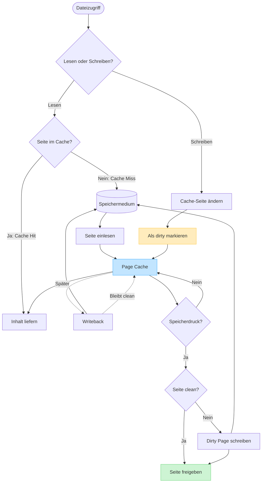

# Exkurs: Der Linux Page Cache

Der **Page Cache** hält Dateiinhalte im Arbeitsspeicher. Er liegt zwischen Prozessen und dem Speichermedium: Wiederholte Lesezugriffe können dadurch ohne erneutes Storage-I/O bedient werden, während Schreibzugriffe zunächst im RAM gesammelt und später zurückgeschrieben werden. Freies RAM bleibt so nicht ungenutzt, sondern beschleunigt Datei-I/O.

## Ablauf von Lesen, Schreiben und Reclaim



## Lesezugriff: Cache Hit oder Cache Miss

Beim Lesen prüft der Kernel, ob die benötigte Dateiseite bereits im Page Cache liegt:

- Bei einem **Cache Hit** können die Daten direkt aus dem RAM geliefert werden.
- Bei einem **Cache Miss** werden sie vom Speichermedium eingelesen und im Page Cache abgelegt.
- Erkennt der Kernel ein sequentielles Zugriffsmuster, kann **Read-ahead** weitere Seiten vorsorglich laden.

Auch mit `mmap()` abgebildete Dateien verwenden den Page Cache. Der erste Zugriff auf eine noch nicht residente Seite löst einen Page Fault aus; der Kernel lädt die Seite und verknüpft sie mit dem virtuellen Adressraum des Prozesses.

## Schreibzugriff: Dirty Pages und Writeback

Ein gewöhnlicher `write()` verändert zunächst die Seite im Page Cache. Die Seite wird als **dirty** markiert, weil ihr Inhalt neuer ist als die Version auf dem Speichermedium. Der Kernel schreibt solche Seiten später per **Writeback** zurück. Dadurch kann er mehrere Änderungen bündeln und I/O effizient planen.

Ein erfolgreicher `write()` garantiert deshalb noch keine dauerhafte Speicherung. Benötigt eine Anwendung eine definierte Persistenzgrenze, verwendet sie beispielsweise `fsync()` oder `fdatasync()`. Auch danach hängen die genauen Garantien vom Dateisystem, Gerät und dessen Cache-Verhalten ab.

## Warum USB-Sticks sicher entfernt werden müssen

Beim Kopieren auf einen USB-Stick kann der Dateimanager bereits „fertig“ melden, obwohl sich noch **Dirty Pages** im Page Cache befinden. Der Kopiervorgang hat dann die Daten an den Kernel übergeben, aber Writeback und gegebenenfalls Aktualisierungen von Verzeichnis, Dateigröße oder Dateisystem-Metadaten sind noch nicht vollständig auf dem Stick angekommen. Wird das Gerät jetzt abgezogen, drohen unvollständige Dateien oder ein beschädigtes Dateisystem.

```text
Anwendung meldet Kopie fertig
              ↓
Daten liegen teilweise noch als Dirty Pages im RAM
              ↓
Writeback überträgt Daten und Metadaten auf den USB-Stick
              ↓
umount wartet auf ausstehende Schreibvorgänge und hängt das Dateisystem aus
              ↓
USB-Stick kann entfernt werden
```

`sync` fordert systemweit an, gepufferte Änderungen auf ihre Datenträger zu schreiben, hängt den USB-Stick aber **nicht** aus. Nach einem `sync` können Programme erneut Dateien öffnen oder verändern. Für das Entfernen ist deshalb `umount` beziehungsweise die Funktion **„Sicher entfernen“** der grafischen Oberfläche entscheidend. Ein erfolgreiches Aushängen schreibt ausstehende Änderungen, beendet die Nutzung des Dateisystems und verhindert neue Zugriffe über diesen Mountpoint.

```bash
sync                         # optional: ausstehende Schreibvorgänge systemweit anstoßen
sudo umount /media/USB       # auf Erfolg warten, erst danach abziehen
```

Meldet `umount`, dass das Gerät noch beschäftigt ist, darf es nicht einfach abgezogen werden. Dann verwendet noch ein Prozess eine Datei oder sein aktuelles Arbeitsverzeichnis liegt auf dem Stick. Grafische „Auswerfen“- oder „Sicher entfernen“-Funktionen können zusätzlich das Gerät logisch deaktivieren; sie sind im Alltag der bevorzugte Weg.

## Reclaim: Cache wieder freigeben

Der Page Cache besitzt keine feste Größe. Bei freiem RAM darf er wachsen; unter Speicherdruck kann der Kernel wenig genutzte Seiten zurückgewinnen:

- **Clean Pages** stimmen mit dem Speichermedium überein und können direkt verworfen werden.
- **Dirty Pages** müssen vor dem Freigeben zunächst zurückgeschrieben werden.
- Wird eine verworfene Seite erneut benötigt, lädt der Kernel sie wieder aus der Datei.

Ein großer Page Cache ist daher normalerweise kein Speicherleck. `MemAvailable` berücksichtigt, dass ein Teil des belegten RAMs zurückgewinnbar ist, und ist für die Kapazitätseinschätzung meist aussagekräftiger als `MemFree`.

## Beobachtung im laufenden System

```bash
free -h
grep -E 'MemAvailable|Cached|Dirty|Writeback' /proc/meminfo
vmstat 1
grep -E 'pgfault|pgmajfault|pgscan|pgsteal' /proc/vmstat
```

`Cached` umfasst neben regulären Dateiseiten auch `tmpfs` und Shared Memory und darf deshalb nicht als exakte Größe aller zwischengespeicherten Dateien interpretiert werden. Ein steigender `Dirty`-Wert zeigt noch nicht automatisch ein Problem; kritisch wird das Muster erst zusammen mit dauerhaftem Writeback, I/O-Latenz oder Speicherdruck.

## Merksätze

- Der Page Cache beschleunigt Lesen und entkoppelt viele Schreibzugriffe vom Storage-I/O.
- Anwendungen und `mmap()`-Mappings einer Datei teilen sich grundsätzlich dieselben gecachten Dateiinhalte.
- Clean Pages sind günstig zu reclaimen; Dirty Pages benötigen vorher Writeback.
- Eine abgeschlossene Kopieranzeige garantiert nicht, dass alle Daten bereits auf einem USB-Stick liegen.
- Vor dem Abziehen ist erfolgreiches Aushängen wichtiger als ein alleiniger `sync`-Aufruf.
- Wenig `MemFree` ist unter Linux normal, solange ausreichend `MemAvailable` vorhanden ist.
- Der Page Cache ist flüchtig und ersetzt keine Persistenzgarantie oder Datensicherung.

## Quellen und Vertiefung

- [Linux-Kernel-Dokumentation: Memory Management Concepts](https://docs.kernel.org/admin-guide/mm/concepts.html#page-cache)
- [Linux-Kernel-Dokumentation: Page Cache](https://docs.kernel.org/mm/page_cache.html)
- [Linux-Kernel-Dokumentation: `/proc/meminfo`](https://docs.kernel.org/filesystems/proc.html#meminfo)
- [Linux-Kernel-Dokumentation: Writeback und Dirty Limits](https://docs.kernel.org/admin-guide/sysctl/vm.html#dirty-background-bytes)
- [Linux-Handbuch: `sync(2)`](https://man7.org/linux/man-pages/man2/sync.2.html)
- [Linux-Handbuch: `umount(8)`](https://man7.org/linux/man-pages/man8/umount.8.html)
