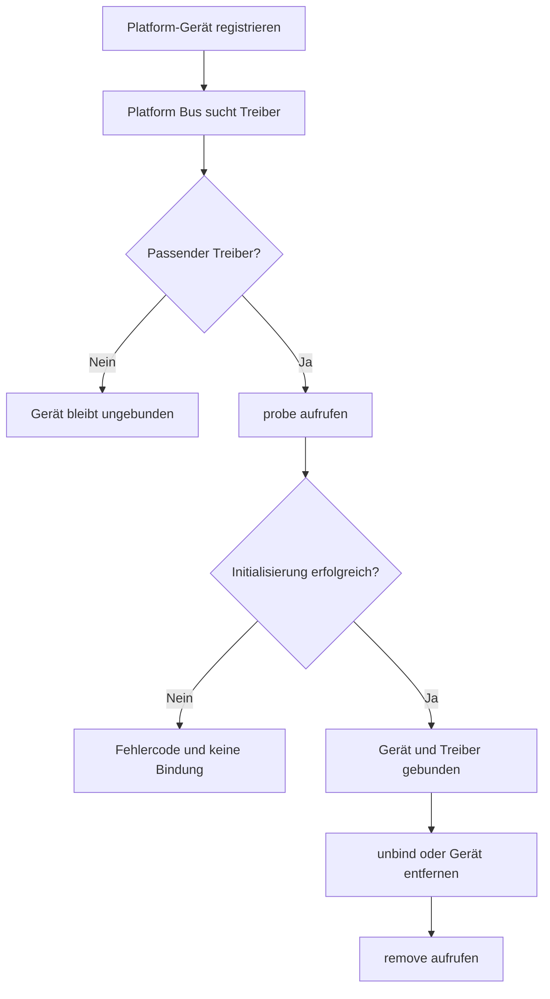

# Exkurs: Übungseinheit zu Linux-Platform-Treibern

## Einordnung

Platform-Treiber werden im Linux-Kernel vor allem für Geräte verwendet, die nicht dynamisch über einen selbstbeschreibenden Bus wie PCI oder USB erkannt werden. Das Betriebssystem kennt diese Geräte beispielsweise durch einen Device Tree, ACPI oder statischen Board-Code.

In dieser Übung wird zunächst ein künstliches Platform-Gerät registriert. Ein zweites Kernelmodul stellt den dazugehörigen Platform-Treiber bereit. Dadurch lassen sich Registrierung, Matching, `probe()`, `remove()` und die Darstellung in sysfs ohne spezielle Hardware untersuchen.

> **Wichtig:** Das künstliche Platform-Gerät dient ausschließlich der Übung. In einem realen Embedded-System wird das Gerät normalerweise durch Device Tree oder ACPI beschrieben. Der eigentliche Gerätetreiber erzeugt das zu steuernde Gerät nicht selbst.

---

## Rahmendaten

- **Dauer:** etwa 90 bis 120 Minuten
- **Schwierigkeitsgrad:** mittel
- **Sozialform:** Einzelarbeit oder Zweiergruppen
- **Zielsystem:** Linux-System oder VM mit passendem Kernel-Build-Verzeichnis
- **Voraussetzungen:** Kernelmodule, Kbuild, `dmesg`, grundlegendes Linux Device Model

## Lernziele

Nach der Übung können die Teilnehmenden:

- `platform_device` und `platform_driver` voneinander unterscheiden,
- das Matching zwischen Gerät und Treiber erklären,
- die Lebenszyklusfunktionen `probe()` und `remove()` implementieren,
- die Bindung eines Geräts in sysfs untersuchen,
- Ressourcen eines Platform-Geräts abfragen,
- gerätespezifische Daten mit `platform_set_drvdata()` verwalten,
- den Zweck der `devm_*()`-Funktionen erklären,
- den Übergang vom Namens-Matching zum Device-Tree-Matching nachvollziehen.

---

## Benötigte Werkzeuge

```bash
sudo apt install build-essential linux-headers-$(uname -r)
```

Prüfen, ob das Build-Verzeichnis vorhanden ist:

```bash
ls -ld /lib/modules/$(uname -r)/build
```

Für die Übung wird folgende Verzeichnisstruktur verwendet:

```text
platform-training/
├── Makefile
├── training_device.c
└── training_driver.c
```

---

## Ablauf der Übung

| Phase | Dauer | Inhalt |
|---|---:|---|
| Einstieg | 10 min | Platform Bus, Gerät, Treiber und Matching |
| Aufgabe 1 | 15 min | Künstliches Platform-Gerät registrieren |
| Aufgabe 2 | 25 min | Platform-Treiber implementieren |
| Aufgabe 3 | 15 min | Bindung über sysfs untersuchen |
| Aufgabe 4 | 20 min | Gerätekontext und Ressourcen ergänzen |
| Erweiterung | 20 min | Device-Tree-Matching oder kontrolliertes MMIO |
| Auswertung | 10 min | Beobachtungen und Transferfragen |

---

## 1. Platform-Gerät registrieren

Das erste Modul erzeugt ein künstliches Gerät mit dem Namen `training-led`.

### `training_device.c`

```c
#include <linux/init.h>
#include <linux/module.h>
#include <linux/platform_device.h>

static struct platform_device *training_device;

static int __init training_device_init(void)
{
    int ret;

    training_device = platform_device_alloc("training-led", PLATFORM_DEVID_NONE);
    if (!training_device)
        return -ENOMEM;

    ret = platform_device_add(training_device);
    if (ret) {
        platform_device_put(training_device);
        return ret;
    }

    pr_info("training_device: Platform-Gerät registriert\n");
    return 0;
}

static void __exit training_device_exit(void)
{
    platform_device_unregister(training_device);
    pr_info("training_device: Platform-Gerät entfernt\n");
}

module_init(training_device_init);
module_exit(training_device_exit);

MODULE_LICENSE("GPL");
MODULE_AUTHOR("Linux Kernel Internals Training");
MODULE_DESCRIPTION("Künstliches Platform-Gerät für eine Übung");
```

### Arbeitsauftrag

1. Übersetzt und ladet zunächst nur das Gerätemodul.
2. Sucht das Gerät in sysfs.
3. Prüft, ob bereits ein Treiber gebunden ist.

```bash
make
sudo insmod training_device.ko

ls -l /sys/bus/platform/devices/
ls -l /sys/bus/platform/devices/training-led/
readlink /sys/bus/platform/devices/training-led/driver
```

### Erwartete Beobachtung

Das Gerät erscheint unter `/sys/bus/platform/devices/`. Der symbolische Link `driver` fehlt jedoch, weil noch kein passender Treiber registriert wurde.

---

## 2. Platform-Treiber implementieren

Das zweite Modul registriert einen Platform-Treiber. Sein Name entspricht dem Namen des künstlichen Geräts.

### `training_driver.c`

```c
#include <linux/module.h>
#include <linux/platform_device.h>
#include <linux/slab.h>

struct training_data {
    unsigned int probe_count;
};

static int training_probe(struct platform_device *pdev)
{
    struct training_data *data;

    data = devm_kzalloc(&pdev->dev, sizeof(*data), GFP_KERNEL);
    if (!data)
        return -ENOMEM;

    data->probe_count = 1;
    platform_set_drvdata(pdev, data);

    dev_info(&pdev->dev, "probe(): Gerät initialisiert\n");
    return 0;
}

static void training_remove(struct platform_device *pdev)
{
    struct training_data *data = platform_get_drvdata(pdev);

    dev_info(&pdev->dev,
             "remove(): Gerät wird entfernt, probe_count=%u\n",
             data->probe_count);
}

static struct platform_driver training_driver = {
    .probe = training_probe,
    .remove = training_remove,
    .driver = {
        .name = "training-led",
    },
};

module_platform_driver(training_driver);

MODULE_LICENSE("GPL");
MODULE_AUTHOR("Linux Kernel Internals Training");
MODULE_DESCRIPTION("Platform-Treiber für das künstliche Trainingsgerät");
```

> **Kernelversion beachten:** Aktuelle Kernel verwenden für `platform_driver.remove` einen Rückgabewert vom Typ `void`. Bei älteren Schulungskerneln kann die Callback-Signatur noch `int` erwarten. Maßgeblich ist die Definition von `struct platform_driver` im verwendeten Kernel-Quellbaum.

### Arbeitsauftrag

1. Übersetzt beide Module.
2. Ladet zuerst das Gerätemodul und danach den Treiber.
3. Beobachtet die Kernelmeldungen.
4. Prüft den `driver`-Link des Geräts.

```bash
sudo insmod training_device.ko
sudo insmod training_driver.ko

sudo dmesg | tail -n 20
readlink /sys/bus/platform/devices/training-led/driver
ls -l /sys/bus/platform/drivers/training-led/
```

### Erwartetes Ergebnis

Nach dem Laden des Treibers findet der Platform Bus das bereits registrierte Gerät. Das Namens-Matching ist erfolgreich und der Kernel ruft `training_probe()` auf.

```text
Gerät:  training-led
Treiber: training-led
                 │
                 └── Match → probe()
```

---

## 3. Bindung und Lebenszyklus untersuchen

Ein gebundener Treiber kann über sysfs manuell vom Gerät gelöst und anschließend erneut gebunden werden.

### Treiber lösen

```bash
echo training-led | \
    sudo tee /sys/bus/platform/drivers/training-led/unbind
```

### Treiber erneut binden

```bash
echo training-led | \
    sudo tee /sys/bus/platform/drivers/training-led/bind
```

### Beobachtungsauftrag

Protokolliert, welche Funktion bei jedem Schritt aufgerufen wird:

| Aktion | Erwarteter Callback |
|---|---|
| Treiber nach dem Gerät laden | `probe()` |
| `unbind` ausführen | `remove()` |
| `bind` ausführen | `probe()` |
| Gerätemodul entladen | `remove()` |
| Gerät nach dem Treiber laden | `probe()` |

Die letzte Zeile zeigt, dass die Ladereihenfolge für das Matching grundsätzlich unerheblich ist: Registriert sich die zweite Seite, sucht der Bus erneut nach einem passenden Partner.

---

## 4. Fehlerfall in `probe()` untersuchen

Erweitert den Treiber um einen Modulparameter:

```c
static bool fail_probe;
module_param(fail_probe, bool, 0644);
MODULE_PARM_DESC(fail_probe, "Erzwingt einen Fehler in probe()");
```

Fügt am Anfang von `training_probe()` ein:

```c
if (fail_probe)
    return dev_err_probe(&pdev->dev, -EIO,
                         "erzwungener Initialisierungsfehler\n");
```

Treiber mit erzwungenem Fehler laden:

```bash
sudo insmod training_driver.ko fail_probe=1
sudo dmesg | tail -n 20
readlink /sys/bus/platform/devices/training-led/driver
```

### Auswertung

Wenn `probe()` einen Fehler zurückgibt:

- gilt die Geräteinitialisierung als fehlgeschlagen,
- wird der Treiber nicht an das Gerät gebunden,
- existiert am Gerät kein erfolgreicher `driver`-Link,
- wird `remove()` für diese fehlgeschlagene Initialisierung nicht aufgerufen,
- gibt der Kernel bereits mit `devm_*()` verwaltete Ressourcen automatisch frei.

---

## 5. Ressourcen eines Platform-Geräts

Platform-Geräte können beispielsweise folgende Ressourcen beschreiben:

- MMIO-Adressbereiche mit `IORESOURCE_MEM`,
- Interrupts mit `IORESOURCE_IRQ`,
- DMA-bezogene Informationen,
- plattformspezifische Konfigurationsdaten.

Eine Ressource kann im Treiber abgefragt werden:

```c
struct resource *res;

res = platform_get_resource(pdev, IORESOURCE_MEM, 0);
if (!res)
    return dev_err_probe(&pdev->dev, -ENODEV,
                         "keine MMIO-Ressource vorhanden\n");

dev_info(&pdev->dev,
         "MMIO-Ressource: %pr\n", res);
```

### Didaktischer Fehlerfall

Das bisherige Trainingsgerät enthält absichtlich keine MMIO-Ressource. Wird der obige Code direkt in `probe()` eingefügt, muss die Initialisierung mit `-ENODEV` scheitern.

Damit lassen sich folgende Fragen untersuchen:

1. Welche Meldung erscheint in `dmesg`?
2. Ist der Treiber anschließend gebunden?
3. Wird `remove()` aufgerufen?
4. Was ändert sich nach einem erneuten `bind`-Versuch?

---

## 6. MMIO nur in kontrollierter Umgebung

Ist eine echte und für die Übung vorgesehene MMIO-Ressource vorhanden, kann sie mit einer Device-Managed-Funktion reserviert und in den virtuellen Adressraum des Kernels eingeblendet werden:

```c
struct training_data {
    void __iomem *base;
};

static int training_probe(struct platform_device *pdev)
{
    struct training_data *data;

    data = devm_kzalloc(&pdev->dev, sizeof(*data), GFP_KERNEL);
    if (!data)
        return -ENOMEM;

    data->base = devm_platform_ioremap_resource(pdev, 0);
    if (IS_ERR(data->base))
        return dev_err_probe(&pdev->dev, PTR_ERR(data->base),
                             "MMIO-Ressource konnte nicht eingebunden werden\n");

    platform_set_drvdata(pdev, data);
    return 0;
}
```

Registerzugriffe erfolgen anschließend nicht durch gewöhnliche Pointer-Dereferenzierung, sondern beispielsweise mit:

```c
u32 value = readl(data->base + STATUS_REG);
writel(value | ENABLE_BIT, data->base + CONTROL_REG);
```

> **Sicherheitshinweis:** Keine frei gewählte physische Adresse auf einem normalen PC eintragen und beschreiben. Falsche MMIO-Zugriffe können Hardware beeinflussen, das System blockieren oder einen Kernelabsturz auslösen. Für Schreibzugriffe wird ein bekanntes QEMU-Gerätemodell, ein vorbereitetes Entwicklungsboard oder eine ausdrücklich dafür reservierte Ressource benötigt.

### Was erledigt `devm_platform_ioremap_resource()`?

Die Hilfsfunktion kombiniert im Wesentlichen mehrere Schritte:

1. MMIO-Ressource des Platform-Geräts ermitteln,
2. Adressbereich für den Treiber reservieren,
3. physische I/O-Adresse in den Kerneladressraum abbilden,
4. Freigabe an die Lebensdauer des Geräts koppeln.

Scheitert `probe()` später oder wird das Gerät entfernt, wird das Mapping automatisch aufgehoben.

---

## 7. Übergang zum Device Tree

Auf einem Device-Tree-System wird das Platform-Gerät nicht durch das Trainingsmodul, sondern aus einem Knoten im Device Tree erzeugt.

### Beispielhafter Device-Tree-Knoten

```dts
training_led@10000000 {
    compatible = "training,led";
    reg = <0x10000000 0x100>;
    status = "okay";
};
```

Die Adresse ist nur ein Platzhalter und muss zur tatsächlich bereitgestellten Hardware beziehungsweise zum QEMU-Gerätemodell passen.

### OF-Match-Tabelle des Treibers

```c
#include <linux/of.h>

static const struct of_device_id training_of_match[] = {
    { .compatible = "training,led" },
    { }
};
MODULE_DEVICE_TABLE(of, training_of_match);

static struct platform_driver training_driver = {
    .probe = training_probe,
    .remove = training_remove,
    .driver = {
        .name = "training-led",
        .of_match_table = training_of_match,
    },
};
```

Hier erfolgt das relevante Matching über den `compatible`-String. `MODULE_DEVICE_TABLE()` exportiert die Match-Informationen unter anderem für die Modul-Alias-Erzeugung und unterstützt dadurch das automatische Laden des passenden Moduls.

---

## 8. Makefile

```make
obj-m += training_device.o
obj-m += training_driver.o

KDIR ?= /lib/modules/$(shell uname -r)/build
PWD  := $(shell pwd)

.PHONY: all clean

all:
	$(MAKE) -C $(KDIR) M=$(PWD) modules

clean:
	$(MAKE) -C $(KDIR) M=$(PWD) clean
```

### Bauen und testen

```bash
make

sudo insmod training_device.ko
sudo insmod training_driver.ko

sudo dmesg | tail -n 30

sudo rmmod training_driver
sudo rmmod training_device
```

---

## Ablauf des Matchings



---

## Erweiterungsaufgaben

### A. Mehrere Geräteinstanzen

Registriert zwei Instanzen des gleichen Gerätetyps. Untersucht:

- wie die Instanzen in sysfs benannt werden,
- wie oft `probe()` aufgerufen wird,
- ob jede Instanz einen eigenen `training_data`-Kontext erhält,
- welche Gerätebezeichnung `dev_name(&pdev->dev)` liefert.

### B. Benannte Ressourcen

Verseht mehrere Ressourcen mit Namen und fragt sie gezielt ab. Vergleicht die Abfrage per Index mit der Abfrage per Ressourcenname.

### C. IRQ-Ressource

Ergänzt in einer geeigneten Testumgebung eine Interrupt-Ressource. Ermittelt die IRQ-Nummer im Treiber und diskutiert, warum eine erfundene IRQ-Nummer nicht für einen echten Handler verwendet werden darf.

### D. Manuelles Matching stören

Ändert `.driver.name` zu `training-led-wrong` und beobachtet:

- ob `probe()` ausgeführt wird,
- ob ein `driver`-Link entsteht,
- wie Gerät und Treiber in sysfs dargestellt werden.

---

## Leitfragen zur Auswertung

1. Wer erzeugt auf einem realen Embedded-System normalerweise das Platform-Gerät?
2. Wann ruft der Kernel `probe()` auf?
3. Was bedeutet ein erfolgreicher Rückgabewert von `probe()`?
4. Was geschieht, wenn `probe()` einen Fehler zurückgibt?
5. Warum wird `remove()` nach einem fehlgeschlagenen `probe()` nicht aufgerufen?
6. Warum sind `devm_*()`-Funktionen für Fehlerpfade hilfreich?
7. Worin unterscheiden sich Ressourcenbeschreibung, Reservierung und Mapping?
8. Warum müssen MMIO-Register mit `readl()` und `writel()` angesprochen werden?
9. Worin unterscheiden sich Namens-Matching und Device-Tree-Matching?
10. Warum sollte ein echter Gerätetreiber sein eigenes Gerät normalerweise nicht registrieren?

---

## Erwartete Kernaussagen

- Ein `platform_device` beschreibt eine vorhandene Geräteinstanz und ihre Ressourcen.
- Ein `platform_driver` enthält die Logik zur Steuerung passender Geräte.
- Der Platform Bus führt Gerät und Treiber über eine Match-Regel zusammen.
- `probe()` initialisiert genau eine gefundene Geräteinstanz.
- Nur nach erfolgreichem `probe()` besteht eine Bindung zwischen Gerät und Treiber.
- `remove()` löst eine zuvor erfolgreiche Initialisierung wieder auf.
- Gerätespezifische Daten gehören in einen instanzbezogenen Kontext, nicht in globale Variablen.
- `devm_*()` bindet Ressourcen an die Lebensdauer des Geräts und vereinfacht Fehlerpfade.
- Device Tree und ACPI beschreiben Hardware; der Treiber konsumiert diese Beschreibung.
- MMIO darf nur auf einer bekannten, korrekt reservierten Hardware-Ressource ausgeführt werden.

## Merksatz

> Das Platform-Gerät beschreibt, **was vorhanden ist**; der Platform-Treiber beschreibt, **wie dieses Gerät betrieben wird**. Erst ein erfolgreiches Matching mit anschließend erfolgreichem `probe()` verbindet beide.
